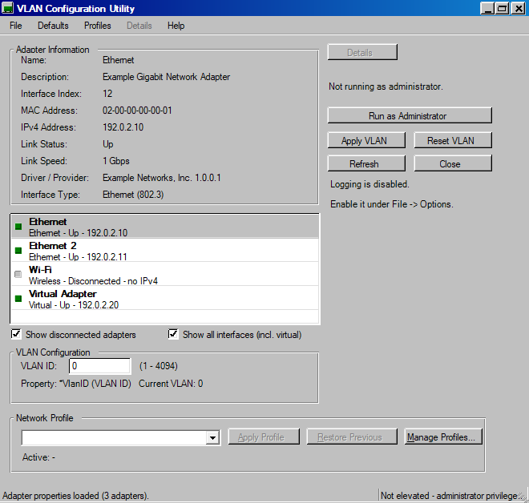
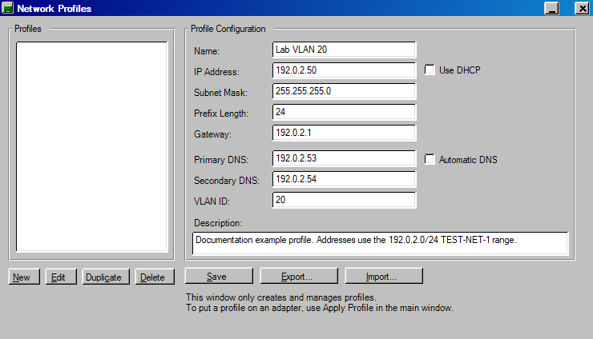
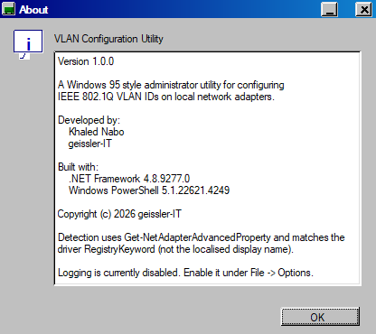

# VLAN Configuration Utility 95

VLAN Configuration Utility 95 is a small Windows administration tool for inspecting network adapters, configuring IEEE 802.1Q VLAN IDs where the driver allows it, and applying reusable IPv4 network profiles.

VLAN, IP, gateway and DNS changes can interrupt network connectivity. Test configurations in a non-production environment first.

It combines current Windows networking functionality with a classic Windows 95-inspired interface.

## Overview

The utility enumerates the network adapters on the machine, shows their current properties, and lets an administrator:

- read and change the VLAN ID of an adapter,
- apply a saved IPv4 profile (static addressing or DHCP),
- restore the configuration that was in place before the last change,
- review exactly which PowerShell commands were executed and what they returned.

The interface is drawn from scratch. There is no third-party UI library and no run-time dependencies beyond .NET Framework.

## Features

- **Adapter discovery** - enumerates physical, wireless, virtual, VPN/tunnel and Hyper-V adapters, including disconnected ones
- **Adapter classification** - labels each adapter by type (Ethernet, Wireless, Virtual, VPN, Hyper-V, Bluetooth, WAN Miniport, Loopback)
- **Adapter details** - description, interface index, MAC address, IPv4/IPv6 addresses, link status, link speed, driver provider and interface type
- **VLAN capability detection** - inspects `Get-NetAdapterAdvancedProperty` and identifies an advanced property that genuinely exposes a configurable VLAN ID
- **VLAN configuration** - apply and reset the VLAN ID where the driver supports it
- **Static IPv4 configuration** - address, subnet mask/prefix length, default gateway
- **DHCP profiles** - switch an adapter back to automatic addressing
- **DNS configuration** - primary and secondary DNS servers, or automatic DNS
- **Network profiles** - create, edit, duplicate, delete, import and export reusable profiles
- **Restore previous configuration** - returns the adapter to its state from before the last applied profile
- **VLAN as part of a profile** - a profile can carry a VLAN ID alongside the IPv4 settings
- **Adapter filtering** - toggle disconnected adapters, and limit the list to virtual interfaces
- **Command details** - view the generated PowerShell, its exit code, stdout and stderr
- **Windows 95-inspired UI** - custom-painted window chrome, buttons, list box, group boxes, menus, status bar and message boxes
- **Optional logging** - off by default, enabled from `File > Options`
- **Administrator handling** - detects elevation state and offers to relaunch via UAC

## Screenshots

Main window, with the adapter list, adapter details and the VLAN section:



Network profile editor:



About dialog:



> The screenshots were captured against synthetic adapter data. All addresses
> shown use the documentation ranges reserved by RFC 5737.

## Requirements

- Windows 10 or Windows 11 (the tool uses the `NetAdapter` PowerShell cmdlets, which require Windows PowerShell 5.1 or later)
- .NET Framework 4.8
- Administrator rights to change adapter configuration

## Installation / Running

Run `VlanConfig95.exe`. It is a single self-contained executable with no installer and no external dependencies.

If the tool is not started with administrator rights, it still opens so the adapter list can be inspected, and offers a **Run as Administrator** button to relaunch elevated through UAC.

## Building from Source

The project builds with the .NET Framework compiler that ships with Windows, so no Visual Studio or .NET SDK is required.

```powershell
# Debug build (default) -> build\VlanConfig95.exe
.\build.ps1

# Release build
.\build.ps1 -Configuration Release
```

There is a batch wrapper for command prompt users:

```bat
build.cmd
build.cmd -Configuration Release
```

The project can also be opened in Visual Studio 2019/2022 or built with MSBuild:

```bat
msbuild src\VlanConfig95.csproj /p:Configuration=Release
```

Source is kept to C# 5 so it compiles with the legacy in-box compiler and with modern Roslyn/MSBuild alike.

## Network Profiles

A profile stores a name, an optional description, and the following settings:

| Field | Notes |
| --- | --- |
| Name | Required |
| IP address | Ignored when DHCP is selected |
| Subnet mask | Dotted quad; the prefix length is derived from it |
| Prefix length | Shown for reference |
| Gateway | Optional |
| Primary/secondary DNS | Ignored when automatic DNS is selected |
| VLAN ID | Optional; validated against the 1-4094 range |
| Use DHCP | Switches the adapter to automatic addressing |
| Automatic DNS | Leaves DNS resolution to Windows |

Profiles are stored per user in `%LOCALAPPDATA%\VlanConfig95\profiles.json` and can be exported to, and imported from, a file. The profile editor itself only manages profiles; applying one is done from the main window.

Example values, using the documentation range reserved by RFC 5737:

| Setting | Value |
| --- | --- |
| Profile name | Lab VLAN 20 |
| IP address | 192.0.2.50 |
| Subnet mask | 255.255.255.0 |
| Gateway | 192.0.2.1 |
| Primary DNS | 192.0.2.53 |
| VLAN ID | 20 |

> Profiles are stored outside the repository, so no real network configuration
> is committed here. Do not commit exported profile files containing addresses
> from a production network.

## VLAN Support / Limitations

**VLAN configuration on Windows is driver-dependent.** Windows itself has no API for setting an 802.1Q tag on an arbitrary adapter. The only supported mechanism is an advanced property exposed by the adapter driver through `Get-NetAdapterAdvancedProperty`.

If the installed driver does not expose such a property, the VLAN section shows the property as unavailable and **Apply VLAN** / **Reset VLAN** stay disabled. This is expected behaviour, not an error.

Drivers differ considerably:

- Some NIC drivers expose a VLAN ID advanced property and it can be set.
- Some expose only tagging switches, filtering toggles or internal identifiers that are not VLAN IDs. The tool deliberately rejects these rather than mislabel a non-VLAN setting as a VLAN ID.
- Some, including many Wi-Fi adapters, virtual switches and most USB adapters, expose nothing at all.
- VLAN support also depends on the switch port being configured for the matching VLAN.

Do not assume VLAN configuration will work on a given network card. Check the driver first.

## Administrator Privileges

Changing IP, DNS, gateway or VLAN settings requires administrator rights. Reading the adapter list works without them.

The manifest requests `asInvoker`, so the tool never silently elevates itself. **Run as Administrator** relaunches the same executable with the `runas` verb, which shows the standard UAC prompt.

APIPA (`169.254.x.x`) self-assigned addresses are treated as "no usable address" when applying a profile, so a failed DHCP lease is not mistaken for a working configuration.

## Privacy / Logging

- Logging is **disabled by default**. When disabled, no log file or log directory is created.
- When enabled, logs are written to `%LOCALAPPDATA%\VlanConfig95\vlan-config95.log`, with rotation and a size cap.
- Logs may contain adapter names, interface indexes and applied addresses. Review them before sharing.
- Profiles and settings are stored per user in `%LOCALAPPDATA%\VlanConfig95\`. Nothing is written outside that folder.
- The application makes no network connections of its own.

## Disclaimer

This project is experimental hobby software and is provided as-is.

Use it at your own risk. The author and geissler-IT make no guarantees regarding correctness, availability, compatibility or fitness for a particular purpose.

The author and geissler-IT are not responsible for data loss, network outages, misconfiguration, service interruption or other damage resulting from the use of this software.

Always verify changes before using the tool in production environments.

## Developer

Khaled Nabo (geissler-IT).

This is a personal hobby project and is not an officially supported geissler-IT product.
